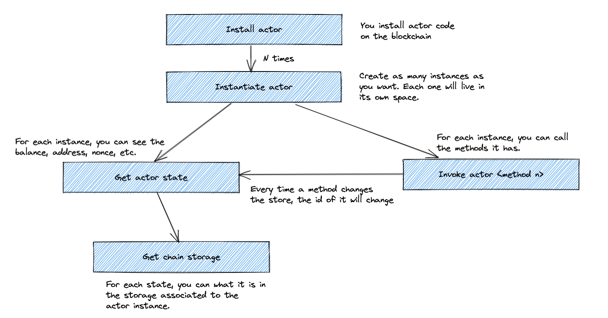

First, you need to install your smart contract on the FVM. Once you have done it, you need to create an instance of it. You can create as many instances as you want. Each one will
live in its own storage space. Finally, you will be able to invoke methods the smart contract has.



### Small cheat sheet
Here you can find a small list of the commands you can run, and how you can get the inputs you need to run them.

```
# Install Actor
lotus chain install-actor <path-to-wasm-binary>

# Instantiate Actor
lotus chain create-actor <actor-id-from-previous-step>

# Invoke actor
lotus chain invoke <method_num>

# Get actor state
lotus state get-actor <address-id-from-create-actor-cmd>

# Get actor storage
lotus chain get <head-from-state-get-actor-cmd>
```
